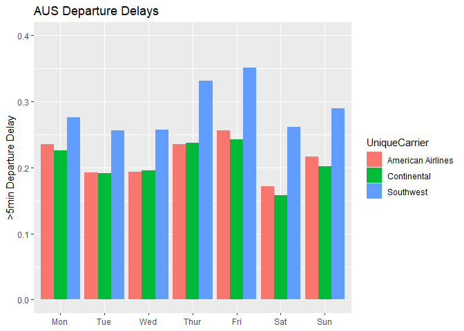
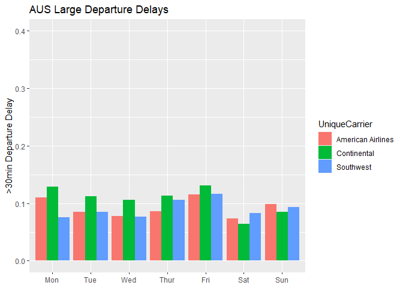
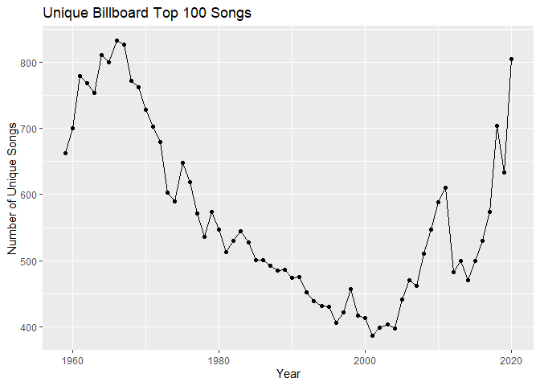
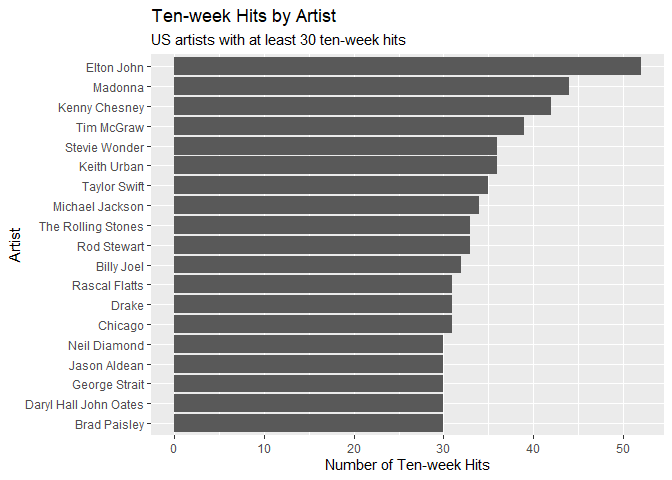
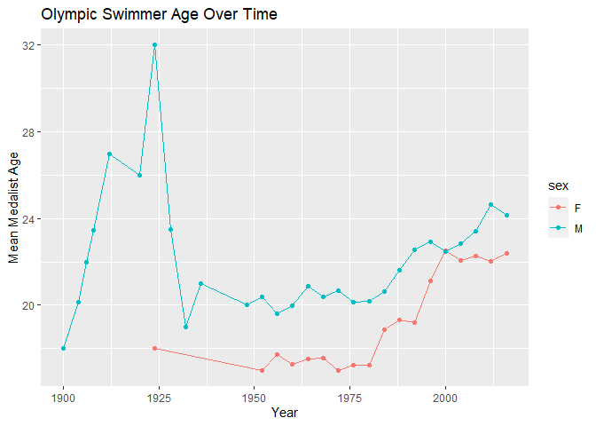
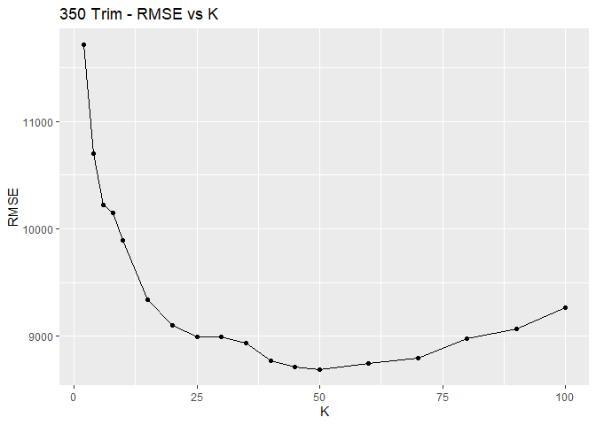
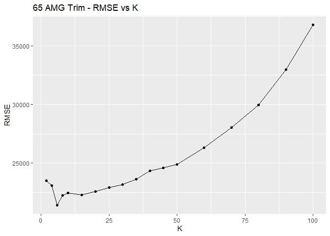
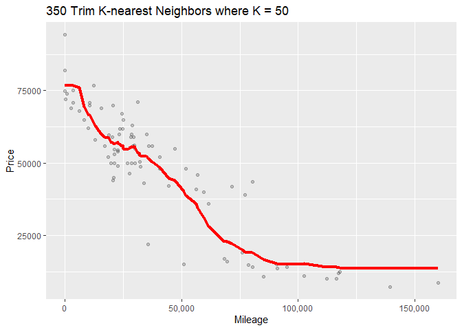

ECO 395 Homework 1: Taylor Neal
================

## 1) Data visualization: flights at ABIA



In the plots above, we can see the average daily proportion of flights
departing from Austin which had departure delays. On the left we count
relatively minor delays (anything over 5min). And on the right we only
count more significant delays of 30min or more (potentially connection
wrecking). The figures focus on the most prominent airlines operating
out of the Austin airport in 2008 (i.e., those with the most departing
flights). As we might expect, delays become more prevalent during times
of high traffic weekend travel with Fridays having the highest rate of
departure delays for all three airlines. Also of note, Southwest
Airlines has a much higher departure delay rate when compared with the
others in our chart on the left. But when compared on the basis of more
significant delays, they are more closely in line with their
competitors. More analysis would be needed to determine if this is in
any way related to their practice of boarding flights with no
pre-assigned seats.

## 2) Wrangling the Billboard Top 100

#### Part A

Utilizing weekly Billboard Top 100 data since 1958 (through week 22 of
2021), we seek to determine the 10 most “popular” songs. For this
exercise, popularity is measured by the total number of weeks a song
spent on the Billboard Top 100.

| performer                                 | song                                | count |
|:------------------------------------------|:------------------------------------|------:|
| Imagine Dragons                           | Radioactive                         |    87 |
| AWOLNATION                                | Sail                                |    79 |
| Jason Mraz                                | I’m Yours                           |    76 |
| The Weeknd                                | Blinding Lights                     |    76 |
| LeAnn Rimes                               | How Do I Live                       |    69 |
| LMFAO Featuring Lauren Bennett & GoonRock | Party Rock Anthem                   |    68 |
| OneRepublic                               | Counting Stars                      |    68 |
| Adele                                     | Rolling In The Deep                 |    65 |
| Jewel                                     | Foolish Games/You Were Meant For Me |    65 |
| Carrie Underwood                          | Before He Cheats                    |    64 |

The table above displays the 10 songs that spent the greatest number of
weeks on the Billboard Top 100 since 1958.

#### Part B

Making use of the same weekly Billboard Top 100 data, we want to
determine if “musical diversity” is changing over time. To do this, we
will measure the number of unique songs present on the Billboard Top 100
for at least one week in a given year. Note that 1958 and 2021 are
incomplete years in this dataset, so each of those years are excluded in
this analysis.

<!-- -->

The chart above indicates that musical diversity varies significantly
over time. Musical diversity experienced a prolonged downtrend until
reaching a low point around the turn of the century. In recent years,
musical diversity has increased substantially and has returned to levels
not seen since the 1960’s.

#### Part C

<!-- -->

The bar plot above shows all US artists with at least 30 “ten-week
hits.” A ten-week hit is defined as a song that appeared on the
Billboard Top 100 for at least 10 weeks.

## 3) Wrangling the Olympics

#### Part A

This section works with Olympics data which contains information on
every medalist in the top 20 sports by participant count. In order to
determine the 95th percentile of height for female competitors across
all track and field events, we filter the Olympic medalists for sex = F
and sport = Athletics (as shown in the code below).

``` r
Part_A = OLYMPICS %>% filter(sport == 'Athletics', sex == 'F')

quantile(Part_A$height, .95)
```

    ## 95% 
    ## 183

As shown above, the 95th percentile for height of female competitors
across all track and field events is 183 cm.

#### Part B

Utilizing the same Olympic medalist data, we seek to determine the
single women’s event with the greatest variability in height (as
measured by standard deviation amongst the competitors).

| event                                 | count | sd_height |
|:--------------------------------------|------:|----------:|
| Rowing Women’s Coxed Fours            |    63 | 10.865490 |
| Basketball Women’s Basketball         |   390 |  9.700255 |
| Rowing Women’s Coxed Quadruple Sculls |    47 |  9.246396 |
| Rowing Women’s Coxed Eights           |   289 |  8.741931 |
| Swimming Women’s 100 metres Butterfly |    48 |  8.134398 |
| Volleyball Women’s Volleyball         |   469 |  8.101521 |
| Gymnastics Women’s Uneven Bars        |    48 |  8.015942 |
| Shooting Women’s Double Trap          |     9 |  7.826238 |
| Cycling Women’s Keirin                |     6 |  7.756717 |
| Swimming Women’s 400 metres Freestyle |    48 |  7.624818 |

The table above displays the 10 female events with the greatest
variability in heights across the history of the Olympics. We find
Rowing Women’s Coxed Fours to have the greatest variability in heights.
The 63 medalists have a standard deviation in heights of almost 10.9 cm

#### Part C

<!-- -->

In the figure above, we find that the average age of Olympic swimmers
has been rising since the 1980’s. Additionally, the average ages of male
and female swimmers seems to differ in multiple regards. Swimming
medalist men have tended to be older than their female counterparts and,
while the average age for men continues to trend upward, the average
female swimmer age has platued at around 22 since the year 2000.

## 4) K-nearest neighbors

In this exercise, we seek to construct a simple predictive price model
for two trim levels of Mercedes S Class vehicles utilizing a K-nearest
neighbors framework. We will use one train/test split (80%/20%) for each
trim category. We will first compare across a wide variety of choices in
K and, then taking the K in each case with lowest RMSE, will construct a
plot of the predicted prices (based on vehicle mileage) alongside the
original data.



The above plots display resulting RMSE for K-nearest neighbor models
utilizing K of 2, 4, 6, 8, 10, 15, 20, 25, 30, 35, 40, 45, 50, 60, 70,
80, 90, and 100. The relatively significant curvature of each plot
suggests there is a definite window for appropriate choices of K. For
reference, the minimum RMSE for each trim under consideration is
displayed below.

    ## [1] 8691.929

    ## [1] 21411.9



The above plots display the K-nearest neighbors model fits (red line)
along with the underlying data for each trim under consideration. We can
see in each case that the models do a reasonably good job of fitting
actual values. Given that we are performing this analysis on a single
train/test split, there is inherent randomness in the exact values of K
which minimize RMSE for each trim considered. Since the 350 trim data
contains relatively more observations, we might expect it to have a
larger optimal K for minimizing RMSE.
