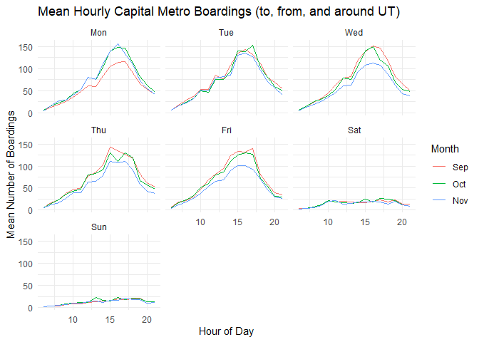
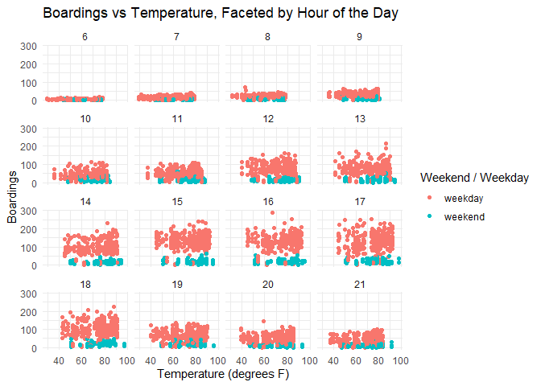
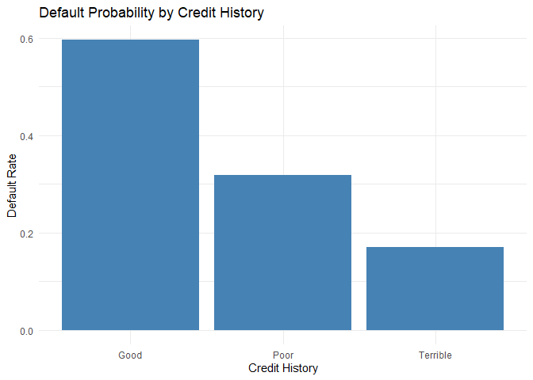
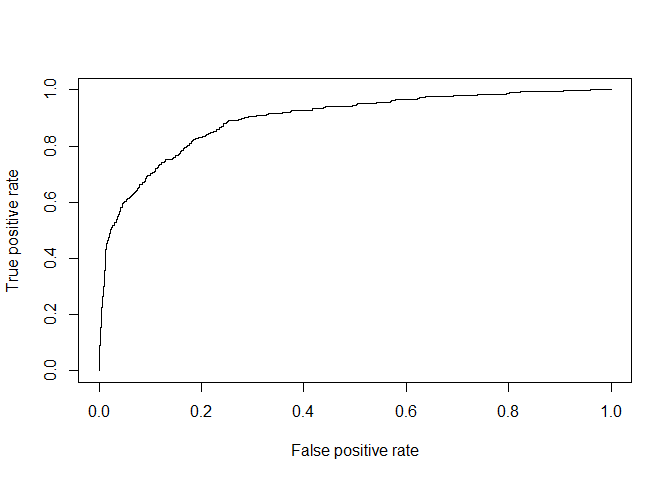

ECO 395 Homework 2: Taylor Neal
================

## 1) Data visualization: Capital Metro Data for UT

<!-- -->

In the figure above, we consider mean number of Capital Metro boardings
during each hour of the day separately for each day of the week. Each
month in our data (September, October, and November) is plotted to
analyze any changes occurring during this time frame. The hour of peak
boardings (and the magnitude of peak boardings) remains quite consistent
across all weekdays with only a slight drop off observed for Fridays.
Weekends see far lower ridership. It is likely that the average
boardings for Mondays in September are relatively lower because the
Labor Day holiday is being averaged in as one of only four Mondays
during that month in 2018. And we would expect that ridership would be
lower on holidays given the decreased reliance on the metro system for
commuting. Similarly, the November lines for Wednesday, Thursday, and
Friday are likely lower because of the Thanksgiving holiday averaging in
amongst the typical weekdays. Overall, this figure seems to indicate
that mean boardings across typical workdays are remarkably consistent
based on this three month time frame.

<!-- -->

Each dot in the figure above represents number of boardings and
temperature during a 15min increment in our Sept.-Nov. 2018 Capital
Metro data. The data are faceted by hour of the day in order to compare
similar periods of any given day with differing temperatures to explore
temperature’s causal impact on boardings. Based on the resulting figure,
it does not appear that temperature has a noticeable impact on UT
student ridership when accounting for hour of the day and whether or not
it is a weekday / weekend.

## 2) Saratoga House Prices

In this section, we seek to determine whether a linear or k-nearest
neighbors approach is better suited to modeling Saratoga housing prices
for determining appropriate property tax assessments. Our data consists
of 15 house characteristics in addition to sales price. We want to
ensure a flexible approach is taken such that we determine the optimal
usage of available data in each modeling case. Additionally, when
evaluating our model results we will seek to reduce randomness
associated with train / test splits of the data by cycling through 20
random folds of said splits (where 20% of the data is reserved for
testing in each fold).

#### Linear Regression Model

For the linear model, we utilized stepwise selection to choose our model
components and interaction variables. After a bit of trial and error
choosing an appropriate starting model for the stepwise process, we
settled on utilizing the following variables: lotSize, landValue, age,
livingArea, pctCollege, bedrooms, bathrooms, fuel, centralAir,
waterfront, newConstruction. From this starting point, the end result
stepwise model was relatively stable when varying the split used to
arrive at a more robust solution with interaction variables and no
excluded individual variables from the dataset got added in. After
settling on the linear model to use (with the additional interaction
terms arrived at via the stepwise process), we utilized 20 random folds
of the housing sales price data and determined an average RMSE across
the folds of approximately 60,146.

#### K-nearest-neighbor Regression Model

As a first step for K-nearest neighbors, we standardized the non-factor
predictor variables in our data to account for the large differences in
scale across the different variables. The K-nearest-neighbors approach
required us to try various values of k for each of the 20 random folds
of our train / test splits. We allowed k to vary from 3 to 29 (skipping
even numbers to avoid any tie issues). K was chosen based on lowest RMSE
across the 20 folds. The resulting K and mean RMSE were 9 and
approximately 61,967 respectively.

#### Conclusions

Through this exercise we discovered that not only did the mean RMSE
across folds come out slightly lower for the linear model, but the
linear stepwise model was also more stable as we allowed for the
randomness of completely different train / test folds. Further work
could be done extending (and likely improving) the linear model by using
the Lasso technique to determine appropriate interaction terms. But as
an initial recommendation, it appears that a linear model is
advantageous for this modeling problem when compared to
K-nearest-neighbors.

## 3) Classification and Retrospective Sampling

<!-- -->

In the figure above, showing a bar plot of the proportion of defaults in
our dataset for the different credit history classifications, we find a
counter intuitive visualization of our data. It appears that a much
higher proportion of the better credit history classifications (i.e.,
“Good” and “Poor” when compared with “Terrible”) were defaults. This is
likely due to the nature of how this data was collected. This
“case-control” design took defaults and attempted to match them with
similar cases where the other case did not default. But this
oversampling of defaults and unnatural sampling combination arising from
seeking out the most similar cases with different results has lead to
the creation of an odd dataset that does not closely resemble any real
world population of cases. Thus, even before attempting to model default
likelihood, we know that it is unlikely a useful model for predicting
out of sample default will be possible.

|                     | Coefficient |
|:--------------------|------------:|
| (Intercept)         |       -0.71 |
| duration            |        0.03 |
| amount              |        0.00 |
| installment         |        0.22 |
| age                 |       -0.02 |
| historypoor         |       -1.11 |
| historyterrible     |       -1.88 |
| purposeedu          |        0.72 |
| purposegoods/repair |        0.10 |
| purposenewcar       |        0.85 |
| purposeusedcar      |       -0.80 |
| foreigngerman       |       -1.26 |

The coefficients obtained in the table above from fitting a simple
logistic regression model of default on duration, amount, installment,
age, history, purpose, and foreign confirm our fears based on the data
collection process and earlier plot. We see that having a worse credit
history rating (“Poor” or “Terrible” - given their negative
coefficients) is actually lowering default probability in this derived
model. This is clearly problematic and an unrealistic thing to expect
when trying to apply such a model to screen prospective borrowers. But
this is very likely due to the sampling process for how this data has
been gathered. And, given that the goal is likely to use prior default
data to avoid taking on risky loans in the future, changes to the bank’s
sampling scheme should be recommended. It would be much better to have a
sample set with default rates more representative of prospective
borrowers as a whole where defaulted loans are not vastly over
represented.

## 4) Children and Hotel Reservations

For this modeling problem we added two engineered features (a dummy
variable for two adults and arrival month as a factor). Utilizing these
additional variables along with an interaction term between
reserved_room_type and the two adults dummy, we were able to gain
performance on both baselines in terms of RMSE and the area under the
ROC curve. Please see model verification steps below (utilizing data
that was completely held out of the fitting and testing phases).

<!-- -->

The plot above shows the ROC for our final model with predictions
compared to the validation set of data which was held out of this
analysis until this step.

| Trial | Accuracy |
|------:|---------:|
|     1 |    94.00 |
|     2 |    93.60 |
|     3 |    94.00 |
|     4 |    95.60 |
|     5 |    95.18 |
|     6 |    94.80 |
|     7 |    96.00 |
|     8 |    92.40 |
|     9 |    95.20 |
|    10 |    95.60 |
|    11 |    94.00 |
|    12 |    95.20 |
|    13 |    95.20 |
|    14 |    94.00 |
|    15 |    93.20 |
|    16 |    94.00 |
|    17 |    96.40 |
|    18 |    88.80 |
|    19 |    94.80 |
|    20 |    92.00 |

As seen in the table above, the model does a decent job at predicting
the number of children with most accuracy rates over 90%.
